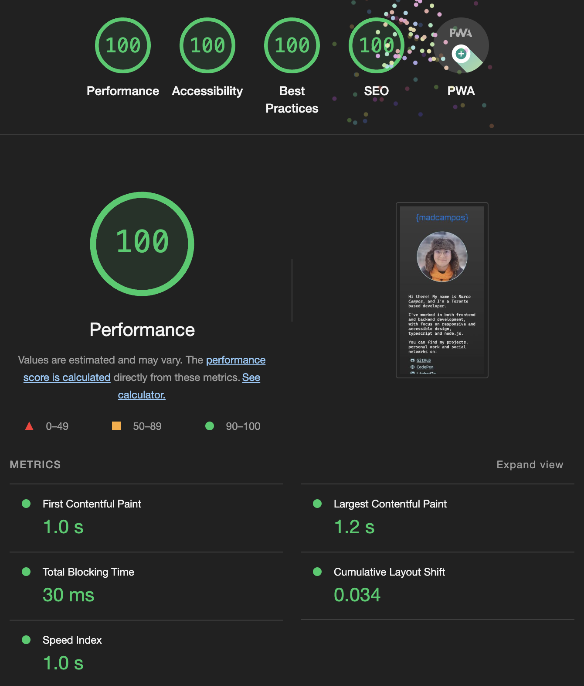
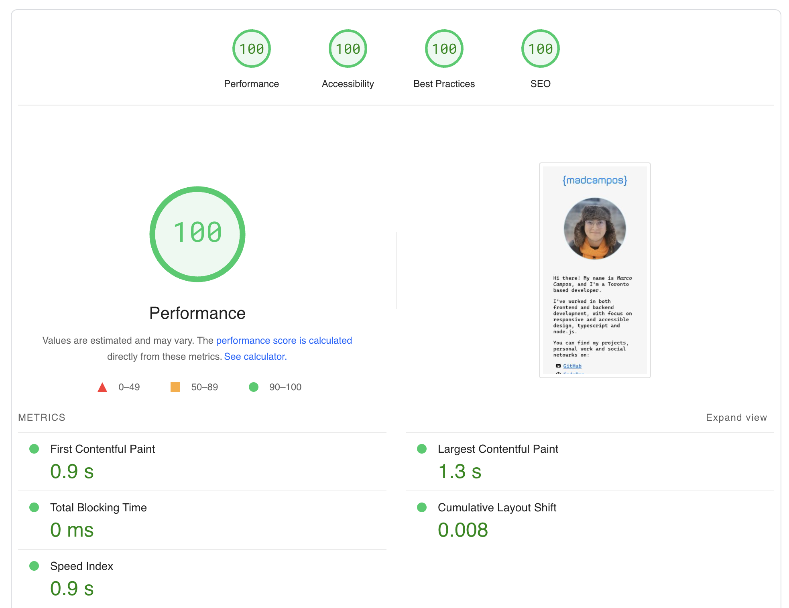
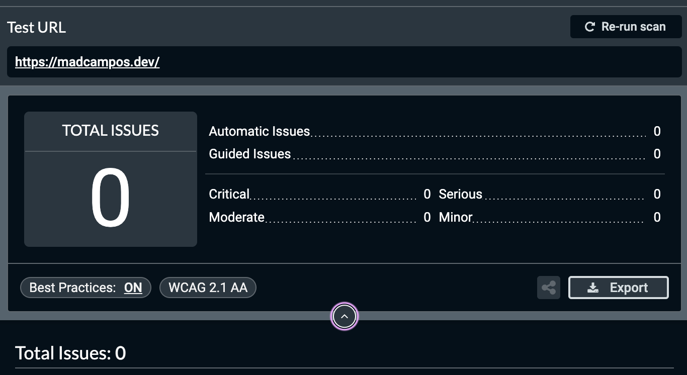

[Now this is a story all about how I got a perfect score and assets size down...](https://youtu.be/1nCqRmx3Dnw?si=QhtnwGRPyCN0u_rE) 🎤🎶

Okay, jokes aside, here is a _breakdown_ of how I got 100 in [PageSpeed](https://pagespeed.web.dev/), [Lighthouse](https://developer.chrome.com/docs/lighthouse/overview/), and [AXE](https://www.deque.com/axe/devtools/chrome-browser-extension/). (And sorry I can't hold myself to a good pun)

## What are those tools?

The two first tools cited, PageSpeed and Lighthouse, are performance analyzers that check how fast and well your page loads. The third one, but no less important is an accessibility analyzer that reports issues with your page's accessibility.

## Why it is important?

One of the core principles of the web is being accessible to all. Even in places with really good internet connection we are constantly in situations where things do not work quite so perfectly.

To give a couple of very real examples on my day to day:
- When taking the subway I get spotty connection. It was only in the end of 2023 that mobile carriers started having service in Toronto's underground.
- When taking the elevator we are locked in a nice [Faraday cage](https://en.wikipedia.org/wiki/Faraday_cage) so connections are effectively blocked.
- In my own home, when I'm at the office, the bathroom with all it's piping and water is between me and the Wi-Fi router. The connection can get bad if someone is showering.

It is interesting that even with super fast connection and cheap data plan we face the same struggles as people in less privileged situations. Being mindful and empathetic of people helps everyone.

## Light in the dark

[Lighthouse](https://developer.chrome.com/docs/lighthouse/overview/) is a tool developed by Google to automate testing how fast a page loads considering various metrics.

The most interesting ones are:
<dl>
	<dt>First Contentful Paint</dt>
	<dd>This shows how much time until something draws on the screen. If your CSS and HTML are small enough, this will be fast.</dd>
	
	<dt>Largest Contentful Paint</dt>
	<dd>It is how much time it takes to load the largest content on the page, be it a image or text. This tells how fast your page is to load big things.</dd>
	
	<dt>Cumulative Layout Shift</dt>
	<dd>It tells how much the content jumps around due to new images, fonts and other assets finishing loading. Shouldn't be a problem if your fonts match in size and if your image tags contain the image intended size.</dd>
</dl>

Here are my results:

## All about speed

[PageSpeed](https://pagespeed.web.dev/) is the online version of Google's lighthouse tool. In it you can test a url in a headless browser and see how that will perform. In this case it is basically a "dark-mode-less" version of Lighthouse.

Here are my results:

## Chopping errors like wood

[AXE](https://www.deque.com/axe/devtools/chrome-browser-extension/) is the "outlier" here, but in an excellent sense! It checks only for accessibility issues. So it will basically tell how worse I'm making the web for everyone using it.

The web is inherently accessible, it is designed to be used by everyone and take into consideration things we usually don't think about. The problem is in our pursue to make things pretty and shiny we end up stripping much of that inherent context and functionality.

In short, as long as you add descriptions to images, use semantic html and don't try to reinvent the wheel it will work more or less reasonably.

Here are my results by the way:

## What the hack?!

So, the question now is:

> How did you get such a perfect score?

The secret sauce is simplicity and no Javascript! Don't get me wrong, I earn a living by programming in Javascript. _BUT_, when it comes to tools, I must choose the one that is better suited to my use case.

In the case of my site, I want to show it to people on the go, have a couple of relevant links, my picture, and a short description.
To achieve all of those things I only need HTML and a sprinkle of CSS on top. It doesn't _need_ to be highly dynamic and use something like react.

_BUT_... I'm cheating here as my site is built with nice react-y components using [astro](https://astro.build). The difference is all those components get pre-processed in a build step and output to static HTML files.

## Version 1.0

It is interesting to think about how the site came to be. Before using astro for building it the first attempt of producing a site was in plain HTML and using [vite](https://vitejs.dev/). It still didn't have any Javascript and was blazingly fast.

The whole philosophy on how I approach building things is to keep it simple and use the tools available in the best way possible. That means my [first markup](https://github.com/madcampos/madcampos.github.io/blob/f6193b99dec205c840a92088ddb463ae0c6b486b/src/index.html) was already quite accessible.

## #Brag

In short, I wanted to brag about how I build things in a performant way and that is quite nice to achieve something. That is it, no big moral at the end.

Here is another meme to close things off:

