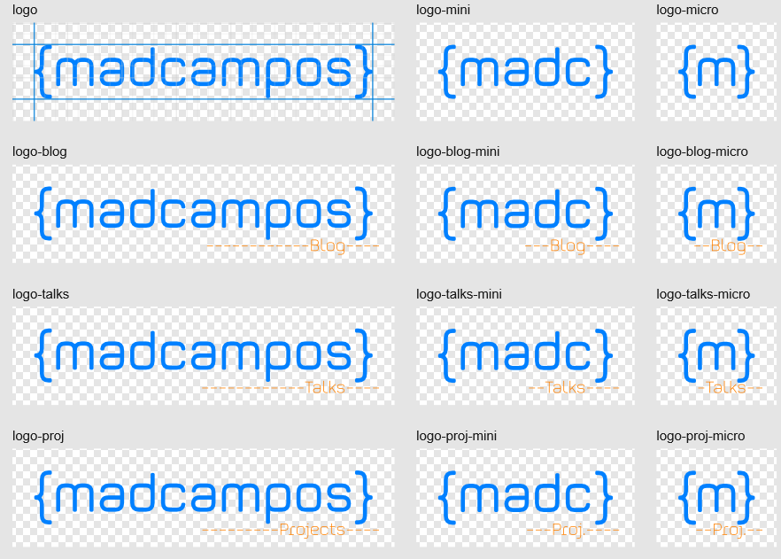

So... SVGs are _FUN_!

Or as the saying goes:

> SVGs put the _"fun"_ in _"dysfunctional"_!

So, buckle up for an adventure in SVG land full of changes in course and self references... _(foreshadowing)_

## A wee bit of context

It's been a while that SVGs fascinated me, I think vector graphics caught my attention during the Flash era but I only gave them a chance around 2012 when I was trying to play with filters and animations for a web based D&D tabletop project.

The project got out of the paper mostly because it is one of those super hard things, absolutely cool, but still super hard. And I moved to other things.

Still, SVGs cemented themselves in my mind as _the_ way to have cool effects in images that looked halfway decent and not low quality pieces of JPEG artifacts ([pun intended](https://en.wikipedia.org/wiki/Compression_artifact)).

Anyways, to SVG's history and context...

## SVGs in a nutshell

[SVG](https://developer.mozilla.org/en-US/docs/Web/SVG) is a vector graphics file format. The nice thing about it is it is also written in plain text in a dialect of XML, so if you've written any HTML in your life you can get a fair grasp of SVG out of the box.

As a vector file format you describe what you want drawn on the screen instead of listing all the pixels one by one[^1].

Because the SVG standard is also under the W3C, it has lots of interoperability and ideas that cross paths with HTML and CSS. Think [gradients](https://developer.mozilla.org/en-US/docs/Web/SVG/Tutorial/Gradients), [rectangles with rounded borders](https://developer.mozilla.org/en-US/docs/Web/SVG/Tutorial/Basic_Shapes#rx), [masks](https://developer.mozilla.org/en-US/docs/Web/SVG/Tutorial/Clipping_and_masking), [animations](https://developer.mozilla.org/en-US/docs/Web/SVG/SVG_animation_with_SMIL), [effects](https://developer.mozilla.org/en-US/docs/Web/SVG/Tutorial/Filter_effects), and [putting cool borders on things](https://developer.mozilla.org/en-US/docs/Web/SVG/Tutorial/Fills_and_Strokes).

SVG also defines a [Document Object Model (DOM)](https://developer.mozilla.org/en-US/docs/Glossary/DOM) similar to HTML, so you can use JavaScript to make it even more interesting and use CSS to select parts of an SVG image (when it is [_inline_ in HTML](https://developer.mozilla.org/en-US/docs/Web/SVG/Tutorial/SVG_In_HTML_Introduction)).

## Logos and Branding

So, SVGs can be used as an image, by simply referencing the file, like this:

```html

```

But the fun really happens when you inline an SVG file into an HTML page. Like this:

```html
<a href="#">
	<svg viewBox="0 0 10 10" width="16" height="16" aria-labeledby="icon-title">
		<title id="icon-title">An icon of a circle</title>
		<circle cx="5" cy="5" r="2" fill="currentColor" />
	</svg>
	<span>A cool link with an icon</span>
</a>
```

In this example, an SVG image is inserted in the HTML and can be manipulated by CSS, in this example, the circle will have the same color as the text.
But that can be changed with regular CSS selectors as well as other properties of the SVG.

For the visual readers, there is what it looks like:

<codepen-embed title="SVG - inline example" href="https://codepen.io/madcampos/pen/WbNQYvE"></codepen-embed>

That super power is the reason the [logos on this website](https://github.com/madcampos/madcampos/blob/main/src/components/Logo/index.astro#L28) are inlined to the HTML instead of image files. It allows the logo to change color and style based on the theme and be interactive as other elements in the page, having hover and active styles, for example.

To make my life a little bit easier and not have to repeat the same wall of SVG text every time[^2], I've wrapped it in an Astro component to make using the logo as easy as referencing it.

## Adapting logos

Although inlining the logo is a good first step, there are three more things that I wanted to achieve with the logo:

1. Have special "easter egg" logos for different themes.
2. Update the logo subtitle dynamically.
3. Changing the logo format depending on the viewport size.

For the first, it is really easy to get done: simply switch the [`display`](https://developer.mozilla.org/en-US/docs/Web/CSS/display) of parts of the SVG depending on the theme.

Both logo "images" (i.e. the actual drawings themselves) live in the html at the same time, and depending on the theme, one is shown and the other is hidden. Very very simple and straightforward trick.

It works like the following demo (a `select` is used for simplicity):
<codepen-embed title="SVG - switch elements" href="https://codepen.io/madcampos/pen/VYwvVaY"></codepen-embed>

Indeed, that was the second version of the logo, after adding it as a component.

Now, the second and third parts present more interesting challenges...

## Texts in SVG

As wild as it may sound, SVG does support writing texts. Shocking, I know!

The coolest part about text in SVG is it has much more control over how things are drawn on the screen than with HTML, it does support the same CSS properties for text but you can also easily apply borders and gradients to text. you can even control how the text is anchored based on a reference point.

The drawback is: it is an image format for doing stuff like in Photoshop, so yes, you have control over text, but it is not a format to write an _essay_ with. It is hard to handle more than a few words.

So, adding the text was as simple as adding a [`<text>`](https://developer.mozilla.org/en-US/docs/Web/SVG/Element/text) tag with some dynamic content, provided by a parameter on the component. Sometimes the simpler solutions are the best[^3]!

Here is a demo of dynamically changing text in SVG:
<codepen-embed title="SVG - text" href="https://codepen.io/madcampos/pen/pvojQEV"></codepen-embed>

## Responsive logo

Now that is the interesting challenge. Not on the logo design itself, but on _how_ to make it work...

For the logo design, that was kind of a solved problem for a while, when I designed the logo the idea of having it adapt to different sizes was already on my mind.

I've conceptualized the logo as different ways to split my handle:

- In long form it is the initials of all my names plus the last one in full: "madcampos" = "m" + "a" + "d" + "campos"
- A shorter form of it is just the initials of all names: "madc"
- The tiny form being only an "m".

All those ways are wrapped with curly braces to give a "he works in tech" vibe.

Writing it out it seems super corny and silly, but well, it is what it is. 🤷‍♂️

Visually, the results are more interesting, I think...



## Responsive SVG

As all logos have different sizes, I could not reuse the same SVG element because it has a _fixed_ [`viewBox`](https://developer.mozilla.org/en-US/docs/Web/SVG/Attribute/viewBox) size... _(foreshadowing)_

The simplest idea was to dump all SVGs in the document and using CSS change their `display`, simple but verbose... _very_ verbose.

## Sidetracking to optimization

More complex SVGs tend to be verbose if you don't optimize them, by default the output of most vector editing applications is terrible. I mean, it is good enough for sharing and maintaining compatibility with old specifications and operating systems, but most of the time you can strip a lot of things and change others to squeeze some juice out of your SVGs.

One way of optimizing things is with the [`<use>`](https://developer.mozilla.org/en-US/docs/Web/SVG/Element/use) tag. It provides a way to reuse other parts of an SVG. That can dramatically improve the size of an SVG, specially if you have many parts that are similar to one another.

So, we can do some things like in this example:

```html
<svg viewBox="0 0 100 100" xmlns="http://www.w3.org/2000/svg" xmlns:xlink="http://www.w3.org/1999/xlink">
    <circle cx="20" cy="20" r="5" id="circle" />

    <use xlink:href="#circle" x="50" y="50" fill="blue" />
    <use xlink:href="#circle" x="40" y="60" fill="red" />
    <use xlink:href="#circle" x="30" y="40" fill="green" />
</svg>
```

And here is it on codepen: https://codepen.io/madcampos/pen/GgRpwQW

Now, that happens to be exactly the case! The different logo sizes are based on one another, many of the elements repeat themselves! It is a win! Horray!

One interesting thing about the `<use>` tag is that you are not limited to only, well, _using_ the thing, you can also change it in some ways, like moving around, scaling, rotating, and changing colors. Some of that is done in the example above.

This solves the problem of the logos getting out of hand and excessively verbose (specially with specific logos for some themes).

So, back to the responsiveness problem...

## Responsive SVG 2: Electric Boogaloo

Everything is nice and tidy with all of the SVG parts being reused, but the problem of a fixed size for the file still persists... Except that technically it doesn't...

Nothing _prohibits_ me from _not adding_ a `viewBox` attribute to the SVG, but doing so makes it display incorrectly, the size of the SVG viewport is inferred from some browser fallback sorcery that makes things display weirdly and be all in different places.

Usually, when I'm stuck with a problem like those, I tend to reach to [MDN](https://developer.mozilla.org/) and go over the list of what is available to me, be it all HTML input attributes, all CSS properties, or in this case all SVG elements.

One thing struck me: you can have SVG elements inside of other SVG elements, like a lovely [matryoshka](https://en.wikipedia.org/wiki/Matryoshka_doll) [file format](https://en.wikipedia.org/wiki/Matroska)!

That gave me an idea:

> What if I add all of the references for the image parts to the main SVG, don't set it's `viewBox`, and then add children SVGs _with_ the `viewBox` set for each logo?

So, I tried something like the following:

```html
<svg xmlns="http://www.w3.org/2000/svg" xmlns:xlink="http://www.w3.org/1999/xlink">
    <!-- Have all definitions in one place... -->
    <defs>
        <circle cx="20" cy="20" r="5" id="circle" />
    </defs>

    <!-- Then use it inside of another SVG -->
    <svg viewBox="0 0 30 30">
        <use xlink:href="#circle" fill="blue" />
    </svg>

    <!-- And another SVG -->
    <svg viewBox="0 0 100 100">
        <use xlink:href="#circle" x="50" y="50" fill="red" />
    </svg>
</svg>
```

<span style="font-weight: bold; font-size: 2em;">IT WORKED! IT EFFING WORKED!</span>

My excitement could not be contained to words or a blog post, I shouted!

## The end?

So, after a long, long exploration on how SVGs work and how to make cool things with it things magically worked and I got cool logos to accompany cool themes! There was still some cleanup to do, and some more details to how to make all of that be nice and tidy in one single SVG, but that is the boring part.

You can check out the [logo source](https://github.com/madcampos/madcampos/blob/main/src/components/Logo/index.astro#L28), I encourage to do so and investigate all of it's details.

Thank you for coming with me in this journey and I hope you have learned something along the way.

[^1]: Yes, there is more to raster images, much more, but they are still a way of listing pixel values, sometimes with many decoding steps.

[^2]: Even though the inline SVG is relatively small and simple, it is still big and most of it is not hand written, so accidentally changing it is not a good idea.

[^3]: Truth ne told, it was _not_ as simple as that... There was a little transforming function to pad the subtitle so it follows a little bit more the style and swap the text for a shorter version if it is too big. But yeah, still a _simple-ish_ solution.
