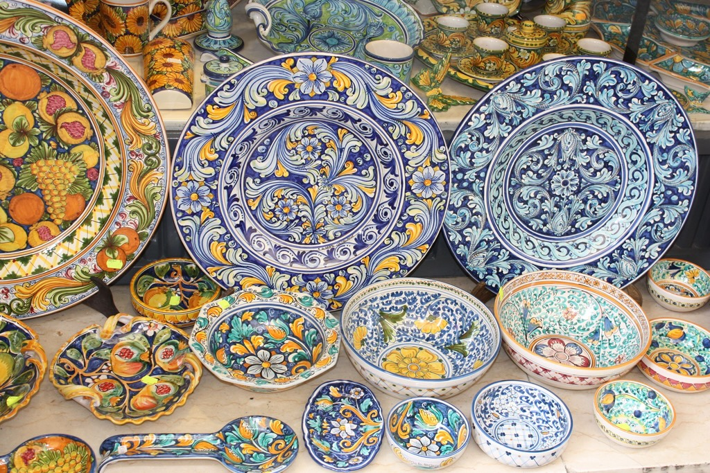

I was invited to give a talk called "Battle of Frameworks", although I _use_ tools like react and angular for work, I am not personally _found_ of those tools. So I decided to build a demo for my part with pure vanilla, gluten-free, non GMO, vegan, organic, home grown HTML, CSS, and javascript.

Don't get me wrong, those frameworks and tools get the work done, help pay the bills and usually I have no problems with them. Besides, trying to build applications with the complexity I work day to day[^1] _without_ the help of those tools would be an herculean task that I'm not willing to take, nor are my employers willing to pay for.

So doing the usual senior dev thing my answer to this is: _It Depends...™_

The main argument is to choose the tool that best solve your problem and not to just choose a tool [by default due to inertia](https://www.lorenstew.art/blog/react-won-by-default/).

Now that the justification is done and hopefully I got the message that this doesn't come from a place of hatred, let's get into the why.

## The "why"

I think the "javascript fatigue" have caught on to me and I yearn for, not necessarily less _complex_, but "simpler" websites in terms of tooling and technologies used.

I want to showcase what the platform can do by itself, without needing extra tools.

We are in a moment where the platform is very much capable of doing almost all we need it to do with what it offers, yet (again, due to inertia) we end up bringing a [neutron star](https://en.wikipedia.org/wiki/Neutron_star) in weight of javascript to achieve things that are better suited for HTML and CSS.

I think we end up so entrenched into the ~~react~~ framework way of doing things that is hard to even think things would be possible to do otherwise, outside the walls and constraints of ~~react~~ the framework. We always need a wrapper instead of using the platform itself.

Ah, yes, there is also the growing amount of supply chain attacks. That is scarry.

But enough yapping, let's get to what the project is about.

## The "what"

My initial idea was to make an Italian restaurant website. I guess I was hungry or craving some pasta at the time... So I just ~~vibed~~ went with this idea.

### The main colours

I wanted to move away from the stereotypical red, white, and green. So I did some research of other things that are associated with Italian culture and found some pictures of gorgeous ceramics in yellow and blue colours.

_Image from here: https://ca.pinterest.com/pin/298433912777986912/_

So that was my choice for colour palette:

- Royal blue as the primary colour.
- Dark golden yellow for the secondary colour.
- Beige for the main background.

### The fonts

The feel I wanted to have is of a modern and inviting place, but with a strong nostalgia and respect for tradition.

For that, a more [cursive typeface](https://fonts.google.com/specimen/Cookie?preview.text=Marco%27s%20Trattoria) for the headings and a [serif typeface](https://fonts.google.com/specimen/Cormorant+Infant?preview.text=Marco%27s%20Trattoria) for the body were chosen.

### The media

I think AI generates images have a _stale_ and _plastic_ feel to them. As fantastic as it can be in mixing together ideas and things, all I got ended up feeling boring and fake. So I got all the photos and videos from [Unsplash](https://unsplash.com/) and [Pexels](https://www.pexels.com/). Beautifully imperfect as they are.

**Side note:** To make them more "web friendly" I lowered the resolution and quality of the images and videos. It could be better optimized, but I didn't want to spend too much time experimenting, so some things may look worse quality than others.

### The pages

After some research[^2] I decided to go with the following general list of pages:

- Home page
- About page
- Reservation page (with a form)
- Recipes page with 3 or 4 actual recipes
- Contact page

### The extra mile

To make the demo more interesting I also wanted to add some features to make the website nicer. Call it _progressive enhancement_... The website works totally fine without those features, but having them makes the experience nicer.

The features are:

- Form validation for the reservation page
- The website needs to be fast and snappy.
- Some SEO to make it show up on Google and social media nicely.
- Ability to install as a PWA and work offline.
- Cool options to share some content.

## What now?

The next steps is building the project itself. That is done on the upcoming posts.

[^1]: For context, the kind of thing I usually have to deal with is going over lists of things and processing them. But those lists are usually 3~5 levels deeply nested, they represent multiple graphs with overlapping and interdependent relationships, and all of this data has to be drawn on the screen in a digestible and navigable manner for the people using the tools. It is a heck of a lot of work, but it is very niche and not your common "landing page + marketing funnel" type of website.

[^2]: By "research" I mean googling "Italian restaurant website template" and checking what kinds of pages people had on their templates.
