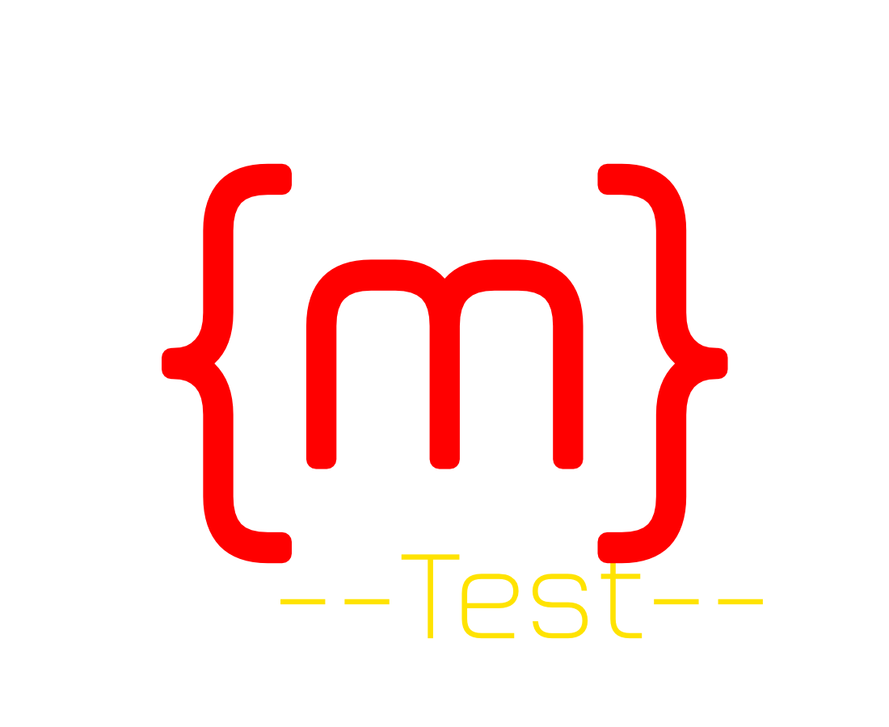

### Test markdown content

This is a **bold** text and this is an _italic_ text.
Here is a [link](https://example.com) and an inline `code` sample.
This text is ==highlighted==.
~~Strikethrough (deleted) text~~
++Underline (inserted) text++

Here is an image:

Here is an inline image: 

### Task list

- [ ] Unchecked task
- [x] Checked task
